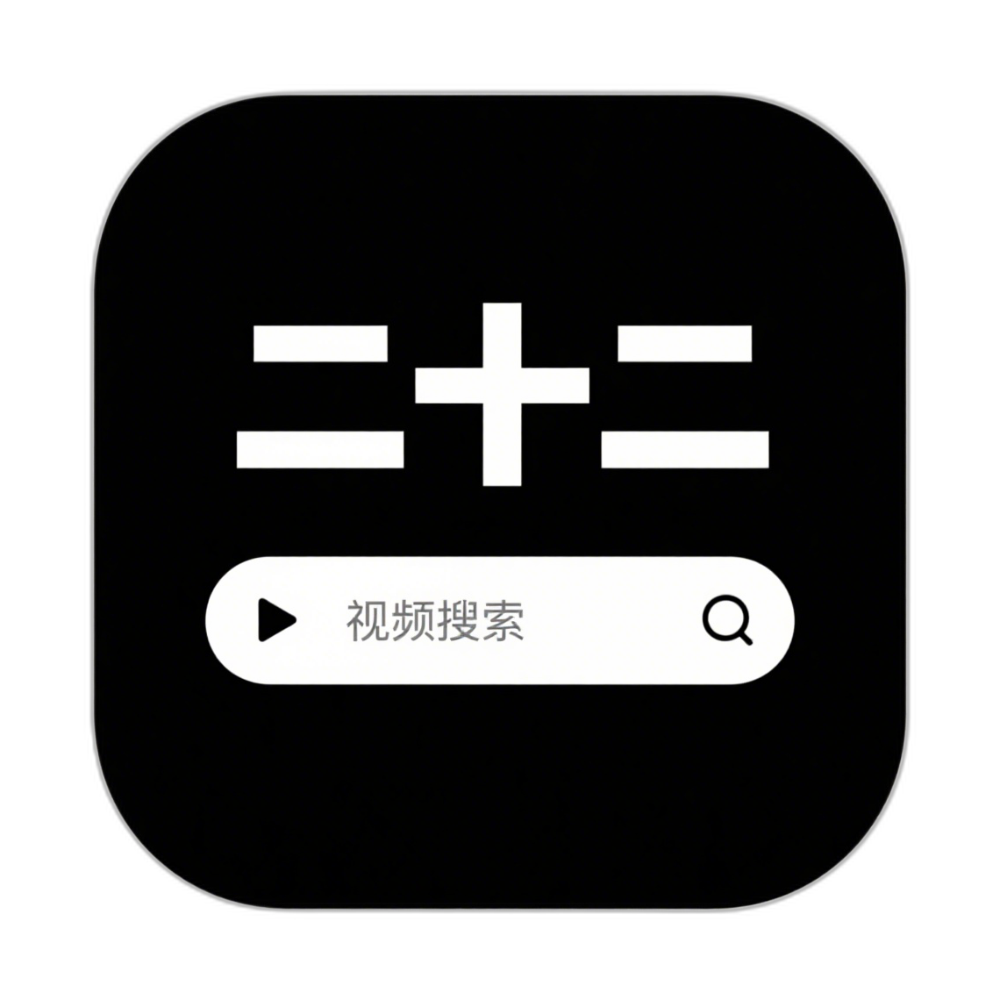
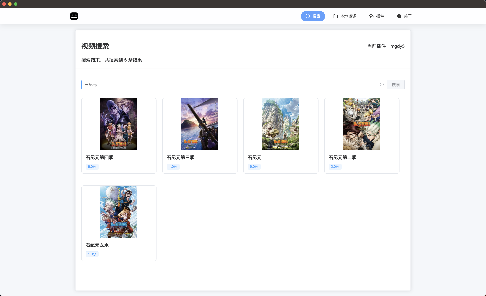
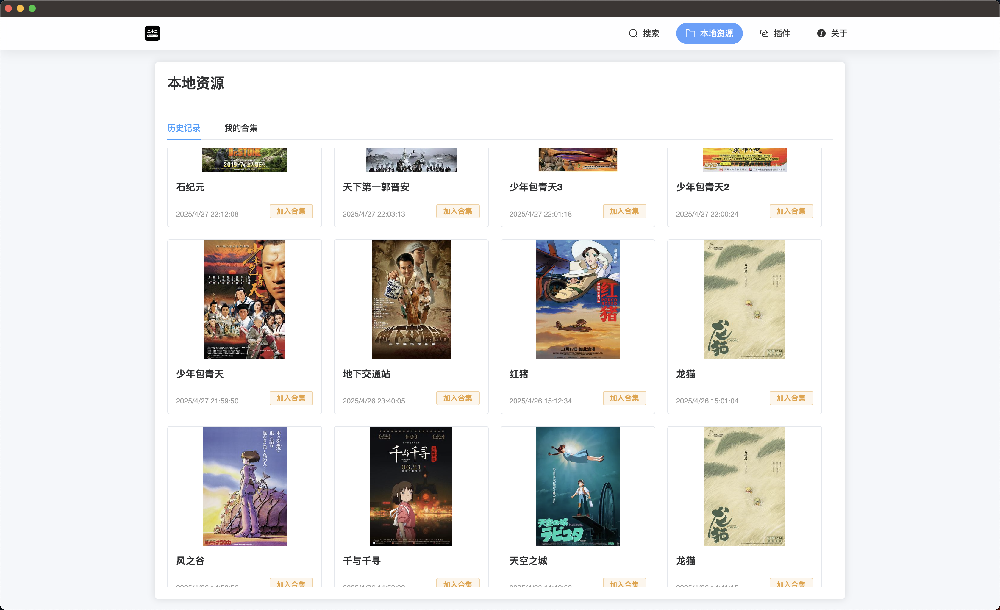
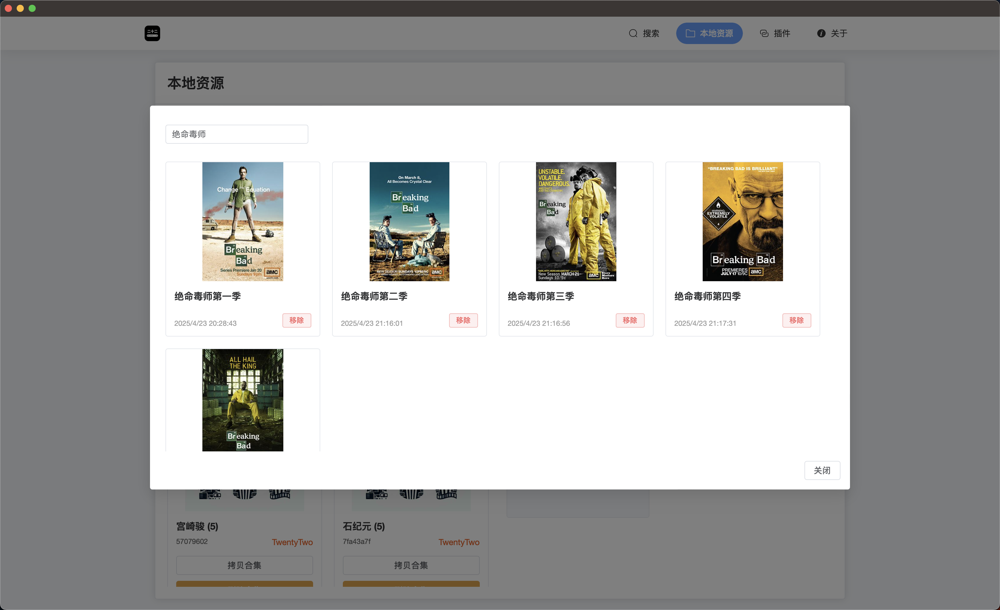

  

一款视频搜索、播放和管理工具

## 📝 项目介绍

TwentyTwo 是一款基于 Tauri,Vue3,Typescript 的跨平台视频搜索、播放和管理工具。
用户可以通过插件搜索和播放各种视频，同时支持创建和管理自己的插件和视频合集。

## 🛠️ 技术栈

- **Tauri**: Tauri 是一个用于构建跨平台桌面应用的工具。它提供了一个统一的 API，使开发者能够使用相同的代码库来构建 Windows、macOS 和 Linux 应用。
- **Vite 6**: Vite 6 是一个现代的前端构建工具，它使用了现代的 JavaScript 特性，如 ES Modules 和 Tree Shaking，来提高构建速度和性能。
- **Vue 3**: Vue 3 是一个流行的 JavaScript 框架，它使用了 Vue 3 的 Composition API 和响应式系统，来构建高效的用户界面。
- **TypeScript**: TypeScript 是一种静态类型的编程语言，它可以在编译时捕获错误，提高代码的可靠性和可维护性。

## 🖼️ 项目预览

## ✨ 功能列表

| 功能分类          | 功能描述             | 状态      |
| ----------------- | -------------------- | --------- |
| 🔍 **视频搜索**   | 根据插件搜索视频     | ✅ 已完成 |
|                   | 视频源地址解析       | ✅ 已完成 |
| 📜 **历史记录**   | 历史记录列表         | ✅ 已完成 |
|                   | 添加历史记录到合集   | ✅ 已完成 |
| 📒**我的合集**    | 新建合集             | ✅ 已完成 |
|                   | 从 URL 导入合集      | ✅ 已完成 |
|                   | 合集分享             | ✅ 已完成 |
|                   | 合集封面自动生成     | 🚧 进行中 |
| 📽️ **视频播放**   | iframe 视频源播放    | ✅ 已完成 |
|                   | 媒体类型视频源播放   | ✅ 已完成 |
|                   | 电影播放             | ✅ 已完成 |
|                   | 连续剧播放           | ✅ 已完成 |
| 👥 **插件开发**   | 从 URL 导入插件      | ✅ 已完成 |
|                   | 插件调试与开发       | ✅ 已完成 |
|                   | 插件启用与删除       | ✅ 已完成 |
|                   | 插件本地使用次数显示 | ✅ 已完成 |
| 🎨 **UI 界面**    | 现代化界面设计       | ✅ 已完成 |
|                   | 皮肤主题切换         | 🚧 进行中 |
|                   | 导入皮肤主题         | 🚧 进行中 |
|                   | 皮肤主题调试与开发   | 🚧 进行中 |
| 🛠️ **系统功能**   | 检查更新             | 🚧 进行中 |
| 🌐 **跨平台支持** | windows/macOS/linux  | ✅ 已完成 |

## ⚖️ 免责声明

1. 使用风险 ：用户使用本软件需自行承担风险。开发者不对因使用本软件而可能导致的任何损失或损害承担责任。
2. 内容责任 ：本软件仅提供视频搜索和播放功能，不存储、上传或分发任何视频内容。用户通过本软件访问的所有内容均来自第三方网站或用户本地文件。
3. 版权声明 ：用户应确保其使用本软件的方式符合相关法律法规，尤其是版权法。用户应对其通过本软件访问、下载或播放的内容拥有合法权利或授权。
4. 第三方插件 ：本软件支持第三方插件，这些插件的内容和功能不受开发者控制。用户使用第三方插件应自行评估风险。
5. 隐私保护 ：本软件尊重用户隐私，不会收集或上传用户个人信息。但用户在使用第三方插件时，应注意相关插件的隐私政策。

## 💬 社区

- [腾讯频道](https://pd.qq.com/g/pd74066781)

## 🎖 贡献

欢迎提交 Issue 或 Pull Request 来帮助改进这个项目！
